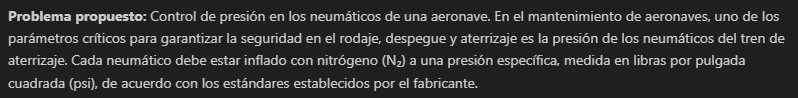
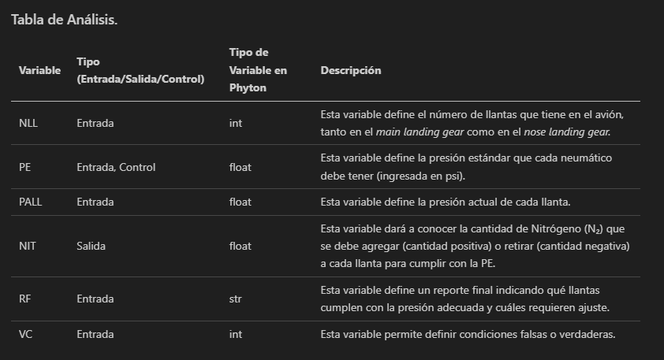
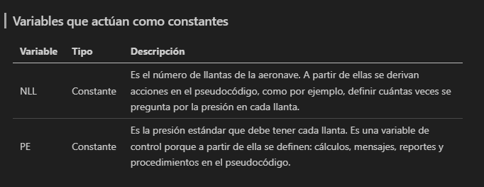
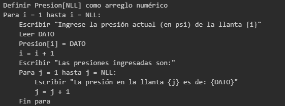
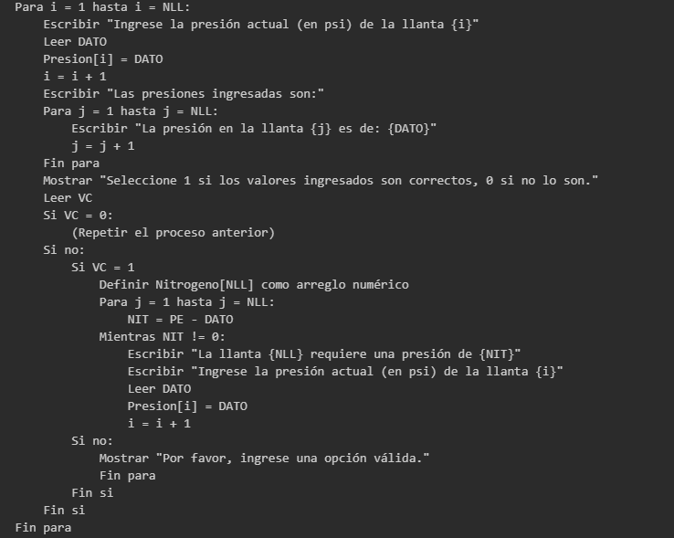
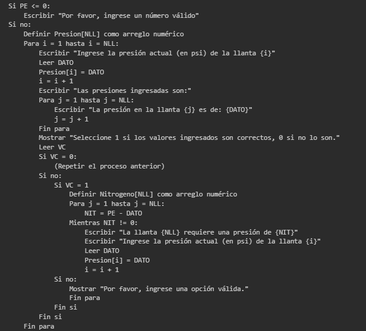

## Tabla 1. Checklist de requisitos del reto (por problema)

| Requisito | Cumple (2) - Cumple Parcialmente (1) - No cumple (0) | Evidencia (página/tabla/figura/sección) |
|-----------|------------------------------------------|------------------------------------------|
| Contexto aeronáutico claro y relevante | 2 |En la imagen se incluye la definición del problema a resolver. Está relacionado con el mundo aeronáutico.  |
| Clara definición y clasificación de las variables de entrada, salida, de control e intermedias | 2 |  |
| Clara definición de las constantes que se utilizan en el problema | 2 |En la imagen se presenta la tabla de análisis donde se declaran las variables a usar, el tipo y la descripción de cada una.  |
| Ecuación que relaciona adecuadamente las variables del problema | 1 | Al momento no se ha definido una ecuación clara que sea la base de todo el problema. Se han utilizado operaciones aritméticas básicas. |
| No es solo cálculo directo | 2 |En la imagen se evidencia el uso de arreglos numéricos, bucles y condicionales, lo cual garantiza que el pseudocódigo no contiene solo un cálculo directo.  |
| Al menos un bucle (variable de control, condición de parada) | 2 |En la imagen se evidencia el uso de bucles "For" (incluso uno dentro de otro). Es posible que se usen bucles "While" en el futuro.  |
| Al menos una sentencia condicional significativa | 2 |En la imagen se presenta el uso de varios condicionales. Se consideran significativos porque son esenciales para la solución del problema. No son sencillos porque, dentro de cada condición (Si, Si no) hay más condicionales, operaciones, arreglos, etc incluidos  |
| Menú repetitivo hasta “Salir” | 0 | No se tiene un menú dentro de cada opción. El reto indica un menú general, con los problemas como opciones. |
| Sin listas, diccionarios, tuplas ni sets | 1 | En el momento, se realizó el pseudocódigo para la solución de este problema con arreglos (listas). Al hablar con el docente, se acordó hacer un cambio en todo el pseudocódigo para garantizar el cumplimiento de este ítem.|
| Declaración de uso de IA (si aplica) | 2 | No se ha usado IA hasta el momento.|
